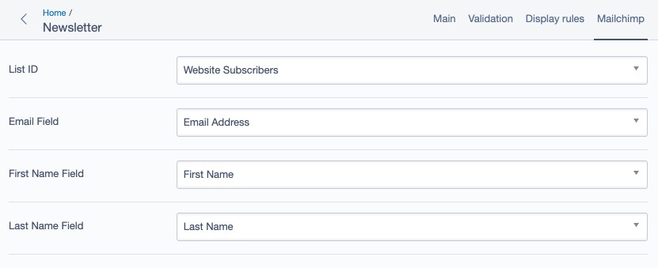

# silverstripe-userforms-mailchimp
Mailchimp signup field for userforms



First install using composer `composer require webfox/silverstripe-userforms-mailchimp`

Then add your API key to `config.yml`

```yaml
EditableMailchimpSubscribeField:
  api_key: '...'
```

Next up add the "EditableMailchimpSubscribeField" field to your form.

If you haven't already add three fields - "Email", "First Name", "Last Name" (name them whatever you want they just need to exist).

Now click show options on the "EditableMailchimpSubscribeField".
Select the list you wish to subscribe users to
Select the Email Field
Select the First Name Field
Select the Last Name Field

Save and publish and laugh away.

In the submission and submission email there are three possible values that should be pretty obvious what they are doing:
* Subscribed
* No
* Failed (Error Message)
